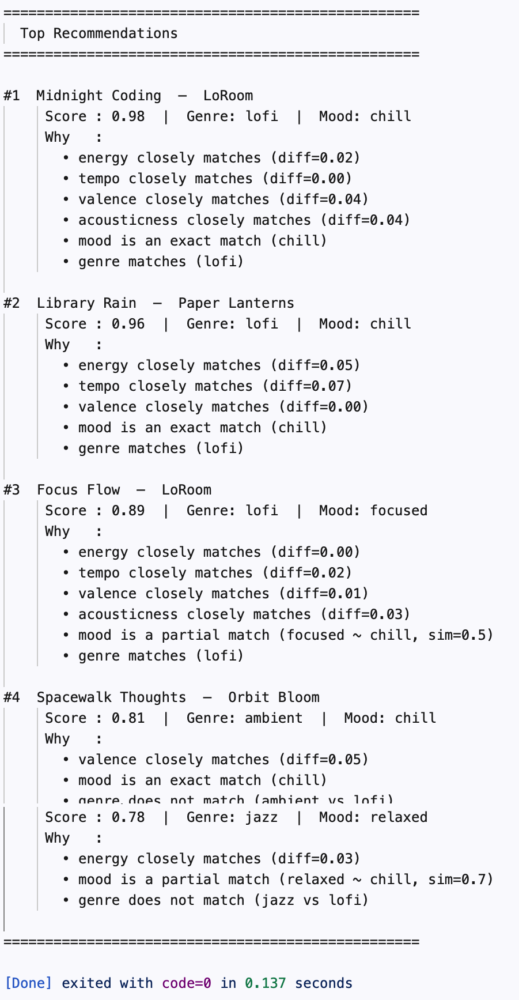

# 🎵 Music Recommender Simulation

## Project Summary

In this project you will build and explain a small music recommender system.

Your goal is to:

- Represent songs and a user "taste profile" as data
- Design a scoring rule that turns that data into recommendations
- Evaluate what your system gets right and wrong
- Reflect on how this mirrors real world AI recommenders

Replace this paragraph with your own summary of what your version does.

---

## How The System Works

This system is a **content-based recommender**: it matches songs to a user purely based on audio features and mood, with no need for other users’ data.

### What features each `Song` uses

Not all columns in `songs.csv` are useful for similarity. `id` and `title` are identifiers; `artist` has too few examples to be meaningful at this scale. The system uses these **5 numeric features** plus **1 categorical feature**:

| Feature | Why it matters |
| --- | --- |
| `energy` | Primary driver of perceived intensity (0.28 ambient → 0.93 gym) |
| `tempo_bpm` | Normalized to 0–1 before scoring; captures slow/fast feel |
| `valence` | Emotional tone — happy vs. melancholic |
| `danceability` | Complements energy; separates rhythmic from atmospheric tracks |
| `acousticness` | Highest variance in the dataset (0.05–0.92); cleanly separates lofi/ambient from electronic |
| `mood` | Categorical label (chill, intense, happy, relaxed, focused, moody); scored as exact match |

`tempo_bpm` is normalized with `(bpm - 60) / (152 - 60)` so it sits on the same 0–1 scale as the other features and doesn’t dominate the score.

### What `UserProfile` stores

A `UserProfile` holds a **taste vector** — one preferred value per feature derived from the user’s listening history. Specifically:

- Preferred values for each numeric feature (e.g., preferred energy = 0.75)
- Preferred mood and genre labels
- Implicit signals: play counts, listen completion rate, and save/skip history, which are used to weight how strongly a past song influences the taste vector

### How `Recommender` scores each song

Each song receives a weighted similarity score against the user’s taste vector. For numeric features, the score rewards proximity — not just high or low values:

```text
feature_score = 1 - abs(song_value - user_preferred_value)
```

For the categorical `mood` feature, scoring is binary:

```text
mood_score = 1.0 if song mood matches user preferred mood, else 0.0
```

The final score is a weighted sum across all features:

```python
weights = {
    "energy":       0.25,
    "mood":         0.20,
    "tempo_bpm":    0.20,
    "valence":      0.15,
    "acousticness": 0.10,
    "danceability": 0.10,
}
score = sum(weights[f] * feature_score(f) for f in weights)
```

### How songs are chosen (Scoring Rule → Ranking Rule)

Scoring and ranking are two separate steps:

1. **Scoring Rule** — evaluates each song independently against the user profile, producing a score in [0, 1]
2. **Ranking Rule** — sorts all scored songs descending, excludes the seed song (the one the user is currently playing), and returns the top N results

This separation matters: scoring is a local, per-song operation; ranking is a global decision over the full catalog. Changing the scoring formula (e.g., switching from absolute difference to Gaussian similarity) does not require changing the ranking logic, and vice versa.

```text
Scoring  →  [Library Rain: 0.91, Focus Flow: 0.88, Rooftop Lights: 0.54, ...]
                                    ↓
Ranking  →  sort descending, exclude current song, return top 3
                                    ↓
Output   →  [Library Rain, Focus Flow, Midnight Coding]
```

---

### Algorithm Recipe

The complete pipeline, from user preferences to top-K recommendations:

```text
INPUT:  user_prefs  — dict of target feature values
        songs       — all rows loaded from songs.csv
        k           — number of recommendations to return
        weights     — importance of each feature (must sum to 1.0)

STEP 1 — Normalize
  For each song: tempo_normalized = (tempo_bpm - 60) / (152 - 60)

STEP 2 — Score every song
  For each song in catalog:
    numeric_score  = Σ weights[f] × (1 - abs(song[f] - user_prefs[f]))
                     for f in [energy, tempo, valence, danceability, acousticness]
    mood_score     = weights[mood]  × mood_proximity(song.mood, user_prefs.mood)
    genre_score    = weights[genre] × (1.0 if match else 0.0)
    total_score    = numeric_score + mood_score + genre_score

STEP 3 — Rank
  Sort all songs by total_score descending
  Remove the seed song (currently playing)
  Return top K
```

**Finalized weights:**

```python
weights = {
    "target_energy":       0.25,  # strongest numeric signal
    "favorite_mood":       0.20,  # cross-genre listener-state signal
    "target_tempo":        0.20,  # activity level
    "target_valence":      0.15,  # emotional tone
    "target_acousticness": 0.10,  # texture / organic vs electronic
    "favorite_genre":      0.10,  # tiebreaker, not a veto
}
# danceability folded into energy weight at this catalog size
```

**Mood uses partial matching, not binary:**

```python
mood_proximity = {
    ("chill", "relaxed"):    0.7,
    ("chill", "focused"):    0.5,
    ("chill", "peaceful"):   0.6,
    ("chill", "moody"):      0.3,
    ("chill", "happy"):      0.2,
    ("chill", "intense"):    0.0,
    ("chill", "aggressive"): 0.0,
    ("chill", "euphoric"):   0.0,
}
```

See [flowchart.md](flowchart.md) for a visual representation of this pipeline.

---

### Expected Biases

| Bias | Cause | Effect |
| --- | --- | --- |
| **Mood sparsity bias** | 16 unique moods across 20 songs — most moods appear once | Without partial matching, mood matching hits ≤2 songs; the system effectively ignores mood for most of the catalog |
| **Genre sparsity bias** | Same distribution as mood | Genre match rarely fires; acts more like a coin flip than a meaningful filter |
| **Filter bubble** | Numeric features reward proximity to one fixed taste vector | The system keeps recommending the same cluster of songs; a lofi listener will never discover jazz even if the audio features are nearly identical |
| **Acousticness dominance** | Highest variance feature (0.05–0.92) in the dataset | Small weight changes on acousticness shift scores more than the same change on valence or danceability |
| **Small catalog amplification** | Only 20 songs total | Scores compress — the difference between rank 1 and rank 5 may be <0.05, making top-K feel arbitrary near the boundary |
| **Static profile bias** | `UserProfile` is fixed at runtime | The system cannot adapt if a user's mood shifts mid-session; a user who usually likes chill but starts a workout gets the same recommendations |

---

## Getting Started

### Setup

1. Create a virtual environment (optional but recommended):

   ```bash
   python -m venv .venv
   source .venv/bin/activate      # Mac or Linux
   .venv\Scripts\activate         # Windows

2. Install dependencies

```bash
pip install -r requirements.txt
```

1. Run the app:

```bash
python -m src.main
```

### Example Output



---

### Running Tests

Run the starter tests with:

```bash
pytest
```

You can add more tests in `tests/test_recommender.py`.

---

## Experiments You Tried

Use this section to document the experiments you ran. For example:

- What happened when you changed the weight on genre from 2.0 to 0.5
- What happened when you added tempo or valence to the score
- How did your system behave for different types of users

---

## Limitations and Risks

Summarize some limitations of your recommender.

Examples:

- It only works on a tiny catalog
- It does not understand lyrics or language
- It might over favor one genre or mood

You will go deeper on this in your model card.

---

## Reflection

Read and complete `model_card.md`:

[**Model Card**](model_card.md)

Write 1 to 2 paragraphs here about what you learned:

- about how recommenders turn data into predictions
- about where bias or unfairness could show up in systems like this

---

## 7. `model_card_template.md`

Combines reflection and model card framing from the Module 3 guidance. :contentReference[oaicite:2]{index=2}  

```markdown
# 🎧 Model Card - Music Recommender Simulation

## 1. Model Name

Give your recommender a name, for example:

> VibeFinder 1.0

---

## 2. Intended Use

- What is this system trying to do
- Who is it for

Example:

> This model suggests 3 to 5 songs from a small catalog based on a user's preferred genre, mood, and energy level. It is for classroom exploration only, not for real users.

---

## 3. How It Works (Short Explanation)

Describe your scoring logic in plain language.

- What features of each song does it consider
- What information about the user does it use
- How does it turn those into a number

Try to avoid code in this section, treat it like an explanation to a non programmer.

---

## 4. Data

Describe your dataset.

- How many songs are in `data/songs.csv`
- Did you add or remove any songs
- What kinds of genres or moods are represented
- Whose taste does this data mostly reflect

---

## 5. Strengths

Where does your recommender work well

You can think about:
- Situations where the top results "felt right"
- Particular user profiles it served well
- Simplicity or transparency benefits

---

## 6. Limitations and Bias

Where does your recommender struggle

Some prompts:
- Does it ignore some genres or moods
- Does it treat all users as if they have the same taste shape
- Is it biased toward high energy or one genre by default
- How could this be unfair if used in a real product

---

## 7. Evaluation

How did you check your system

Examples:
- You tried multiple user profiles and wrote down whether the results matched your expectations
- You compared your simulation to what a real app like Spotify or YouTube tends to recommend
- You wrote tests for your scoring logic

You do not need a numeric metric, but if you used one, explain what it measures.

---

## 8. Future Work

If you had more time, how would you improve this recommender

Examples:

- Add support for multiple users and "group vibe" recommendations
- Balance diversity of songs instead of always picking the closest match
- Use more features, like tempo ranges or lyric themes

---

## 9. Personal Reflection

A few sentences about what you learned:

- What surprised you about how your system behaved
- How did building this change how you think about real music recommenders
- Where do you think human judgment still matters, even if the model seems "smart"

