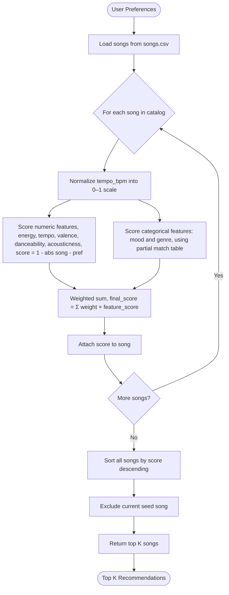

# Recommender System Flowchart

```mermaid
flowchart TD
    A([User Preferences]) --> B[Load songs from songs.csv]

    B --> C{For each song in catalog}

    C --> D[Normalize tempo_bpm into 0–1 scale]

    D --> E[Score numeric features, energy, tempo, valence, danceability, acousticness, score = 1 - abs song - pref]

    D --> F[Score categorical features: mood and genre, using partial match table]

    E --> G[Weighted sum, final_score = Σ weight × feature_score]
    F --> G

    G --> H[Attach score to song]

    H --> I{More songs?}
    I -- Yes --> C
    I -- No --> J[Sort all songs by score descending]

    J --> K[Exclude current seed song]

    K --> L[Return top K songs]

    L --> M([Top K Recommendations])
```
